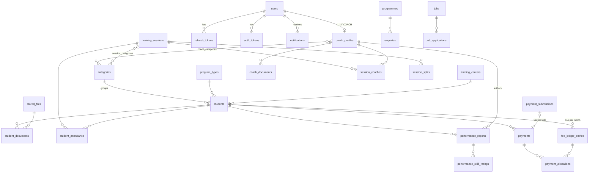

# Database Design

PostgreSQL 16, SQLAlchemy 2.0 (`Mapped[]`, `mapped_column()`), Alembic migrations.

---

## 1. Global conventions

| Topic | Decision | Why |
|-------|----------|-----|
| Primary keys | `uuid` generated in Python (`uuid.uuid4`; switch to `uuid7` on Python 3.14) | Not guessable, so ID enumeration is harder (defence in depth; authorisation still decides). Safe to expose in URLs. |
| Human codes | Separate unique columns (`student_code`, `receipt_number`, `submission_number`) generated from the `counters` table | Staff need short readable numbers; they must not double as access keys |
| Timestamps | `created_at`, `updated_at` as `timestamptz` (UTC), server default `now()`; `updated_at` set by the ORM `onupdate` | Uniform audit trail |
| Business dates | `date` columns (`session_date`, `due_date`, `paid_on`). "Today" = `Asia/Kolkata` | Avoids the UTC-date bug present in the frontend |
| Money | `numeric(12,2)` | Exact arithmetic; never `float` |
| Enums | PostgreSQL native enums via `sqlalchemy.Enum(PyEnum, name=...)` | DB-level integrity. Adding a value needs a migration, which is acceptable |
| Case-insensitive uniqueness | `citext` extension for emails; unique index on `lower(name)` for reference names | `Coach@x.com` = `coach@x.com` |
| Search | `pg_trgm` GIN indexes on names/codes used with `ILIKE '%q%'` | Fast substring search |
| Status vs soft delete | `status` / `is_active` columns where the UI has an active toggle. **No generic soft delete.** Deletes are refused (`409`) when history exists | The UI already models "deactivate"; soft delete everywhere complicates every query and unique constraint |
| FK delete rules | `RESTRICT` for anything with financial or attendance history; `CASCADE` only for pure child rows (splits, ratings, allocations of a payment); `SET NULL` for optional references (`uploaded_by`, `reviewed_by`) | History must not disappear by accident |
| Constraint naming | SQLAlchemy `MetaData(naming_convention=...)` | Alembic can generate stable, droppable constraint names |

Extensions: `citext`, `pg_trgm`.

---

## 2. Entity overview



32 tables in total. Every table maps to a screen or business rule found in the frontend analysis.

---

## 3. Identity and auth

### `users`
| Column | Type | Constraints / default |
|--------|------|-----------------------|
| id | uuid | PK |
| email | citext | **unique**, not null |
| password_hash | text | **nullable** (NULL until the invite is accepted) |
| full_name | varchar(120) | not null |
| role | enum `user_role` (`ADMIN`, `COACH`) | not null |
| is_active | bool | not null, default true |
| is_verified | bool | not null, default false (true once a password is set via invite/reset) |
| token_version | int | not null, default 0 (bumped to invalidate all access tokens) |
| last_login_at | timestamptz | null |
| created_at / updated_at | timestamptz | |

Indexes: unique `email`; `(role, is_active)`.
**Decision:** single `full_name`, not first/last. The frontend uses one name field everywhere, and Indian naming conventions (initials, single names, patronymics) do not split cleanly.

### `refresh_tokens`
| Column | Type | Notes |
|--------|------|-------|
| id | uuid | PK |
| user_id | uuid | FK users **CASCADE**, indexed |
| token_hash | char(64) | SHA-256 of the opaque token, **unique** |
| family_id | uuid | indexed; shared by all rotations of one login |
| expires_at | timestamptz | idle expiry (7 days) |
| absolute_expires_at | timestamptz | copied from the first token of the family; rotation cannot extend a login past it (30 days) |
| revoked_at | timestamptz | null |
| replaced_at | timestamptz | null; set when this token is rotated |
| user_agent | varchar(300) | null |
| ip_address | inet | null |
| created_at | timestamptz | |

Reuse detection: presenting a token whose `replaced_at` is older than the grace window (30 s, for two tabs refreshing at once) revokes the whole `family_id`.

### `auth_tokens` (password reset + invite)
| Column | Type | Notes |
|--------|------|-------|
| id | uuid | PK |
| user_id | uuid | FK users CASCADE |
| purpose | enum (`PASSWORD_RESET`, `INVITE`) | |
| token_hash | char(64) | unique |
| expires_at | timestamptz | reset 30 min, invite 72 h |
| used_at | timestamptz | null; single use |
| created_at | timestamptz | |

Issuing a new token of the same purpose invalidates older unused ones (`used_at = now()`).

---

## 4. Coaches

### `coach_profiles`
| Column | Type | Notes |
|--------|------|-------|
| id | uuid | PK (this is the `coachId` exposed by the API) |
| user_id | uuid | FK users **CASCADE**, **unique** |
| phone | varchar(10) | not null, normalised |
| gender | enum `gender` | null |
| blood_group | enum `blood_group` | null |
| experience_years | smallint | check 0–60 |
| joined_date | date | not null |
| address | varchar(300) | null |
| bio | varchar(1000) | null |
| photo_file_id | uuid | FK stored_files **SET NULL** |
| created_at / updated_at | | |

Coach `status` maps to `users.is_active`. There is one source of truth.

### `coach_categories` (pending Q1)
| Column | Type | Notes |
|--------|------|-------|
| coach_id | uuid | FK coach_profiles CASCADE, PK part |
| category_id | uuid | FK categories RESTRICT, PK part |

Index on `category_id` (reverse lookup "which coaches cover this category").

### `coach_documents`
| Column | Type | Notes |
|--------|------|-------|
| id | uuid | PK |
| coach_id | uuid | FK coach_profiles CASCADE, indexed |
| file_id | uuid | FK stored_files RESTRICT, unique |
| title | varchar(120) | |
| kind | enum (`CONTRACT`, `GENERAL`) | default GENERAL |
| uploaded_by_id | uuid | FK users SET NULL |
| created_at | | |

---

## 5. Reference data

### `categories`, `program_types`
| Column | Type | Notes |
|--------|------|-------|
| id | uuid | PK |
| name | varchar(100) | unique index on `lower(name)` |
| description | varchar(500) | null |
| is_active | bool | default true |
| sort_order | int | default 0 |
| created_at / updated_at | | |

### `training_centers`
Same plus `location varchar(300) not null`, `phone varchar(10) null`.

---

## 6. Students

### `students`
| Column | Type | Notes |
|--------|------|-------|
| id | uuid | PK |
| student_code | varchar(20) | **unique** (`MSRF-2026-001`) |
| admission_number | varchar(30) | **unique** |
| admission_date | date | not null |
| full_name | varchar(120) | not null; trigram index |
| date_of_birth | date | not null; app validates not in the future and age 3–25 |
| gender | enum `gender` | not null |
| blood_group | enum `blood_group` | null |
| phone | varchar(10) | null |
| email | citext | null |
| address | varchar(300) | null |
| photo_file_id | uuid | FK stored_files SET NULL |
| category_id | uuid | FK categories **RESTRICT**, indexed |
| program_type_id | uuid | FK program_types RESTRICT, indexed |
| training_center_id | uuid | FK training_centers RESTRICT, indexed |
| batch | enum `batch` (`MORNING`, `EVENING`, `WEEKEND`) | not null |
| monthly_fee | numeric(12,2) | check ≥ 0 |
| status | enum `record_status` (`ACTIVE`, `INACTIVE`) | default ACTIVE, indexed |
| remarks | varchar(500) | null |
| parent_name | varchar(120) | not null |
| parent_relationship | enum `relationship` | not null |
| parent_phone | varchar(10) | not null, **indexed** (payment-submission matching) |
| parent_email | citext | null |
| parent_address | varchar(300) | null |
| emergency_name | varchar(120) | null |
| emergency_relationship | varchar(40) | null |
| emergency_phone | varchar(10) | null |
| created_at / updated_at | | |

Indexes: GIN trigram on `full_name`, `student_code`, `parent_name`; btree `(status, category_id)`; btree `date_of_birth` (birth-year filter uses `date_of_birth >= 'Y-01-01' AND < 'Y+1-01-01'`, which stays index-friendly).

Dropped from the frontend type: `course` (legacy), `coachId`/`coachName` (replaced by category scoping, Q1), all computed metrics (attendance %, totals, fee status, `pendingAmount`), `documents` (child table).

### `student_documents`
Same shape as `coach_documents` without `kind`.

---

## 7. Training sessions and attendance

### `training_sessions`
| Column | Type | Notes |
|--------|------|-------|
| id | uuid | PK |
| session_date | date | not null, indexed |
| created_by_coach_id | uuid | FK coach_profiles **RESTRICT**, indexed |
| venue | varchar(200) | not null |
| start_time / end_time | time | null; check `end_time > start_time` |
| weekly_topic | varchar(200) | null |
| daily_topic | varchar(200) | not null; trigram index |
| explanation | text | not null |
| overview | text | null |
| created_at / updated_at | | |

### `session_categories`
`session_id` (FK CASCADE) + `category_id` (FK RESTRICT), composite PK; index on `category_id`.

### `session_coaches`
| Column | Type | Notes |
|--------|------|-------|
| session_id | uuid | FK training_sessions CASCADE, PK part |
| coach_id | uuid | FK coach_profiles RESTRICT, PK part, indexed |
| session_date | date | **denormalised** copy of the session date |
| role | enum (`CREATOR`, `CO_COACH`) | |
| status | enum `attendance_status` | default PRESENT |
| remarks | varchar(300) | null |

**Unique `(coach_id, session_date)`** enforces "one session per coach per day" in the database, whether the coach is creator or co-coach. Two concurrent submissions cannot both succeed. The denormalised date is kept in sync by the service (the date changes only through PUT, which rewrites these rows).

### `session_splits`
| Column | Type | Notes |
|--------|------|-------|
| id | uuid | PK |
| session_id | uuid | FK CASCADE, indexed |
| position | smallint | unique `(session_id, position)` |
| heading | varchar(120) | |
| duration_minutes | smallint | check 1–300 |
| explanation | varchar(2000) | null |

### `student_attendance`
| Column | Type | Notes |
|--------|------|-------|
| id | uuid | PK |
| session_id | uuid | FK training_sessions CASCADE |
| student_id | uuid | FK students **RESTRICT** |
| session_date | date | denormalised for monthly aggregation |
| status | enum `attendance_status` (`PRESENT`, `ABSENT`, `INFORMED`) | |
| remarks | varchar(300) | null |

Unique `(session_id, student_id)`. Index `(student_id, session_date)` for profile and summary queries. Index `(session_date, status)` for the admin stream.
`Excused` from the frontend type is dropped (no UI uses it).

---

## 8. Performance reports

### `performance_reports`
| Column | Type | Notes |
|--------|------|-------|
| id | uuid | PK |
| student_id | uuid | FK students RESTRICT, indexed |
| coach_id | uuid | FK coach_profiles RESTRICT, indexed |
| report_period | varchar(60) | **unique `(student_id, report_period)`** (pending Q6) |
| recorded_date | date | not null |
| position | varchar(60) | null |
| strong_foot | enum (`RIGHT`, `LEFT`, `BOTH`) | not null |
| strengths | text | |
| areas_for_improvement | text | |
| development_goals | `varchar(60)[]` | validated against config in the app |
| custom_goal | varchar(300) | null |
| coach_remarks | text | |
| overall_rating | smallint | check 1–5 |
| created_at / updated_at | | |

DOB and age are read from `students`, not copied.

### `performance_skill_ratings`
| Column | Type | Notes |
|--------|------|-------|
| report_id | uuid | FK CASCADE, PK part |
| skill | enum `skill` (15 values) | PK part |
| rating | smallint | check 1–5 |
| comment | varchar(500) | null |

**Why rows and not a JSON column:** it enables per-skill trend queries later ("passing over the season"), and the database enforces the 1–5 range. The 15 skills are a fixed, versioned enum. Changing them is a migration, which is intentional for a form that coaches and parents compare over time.

---

## 9. Fees and payments

### `fee_ledger_entries`
| Column | Type | Notes |
|--------|------|-------|
| id | uuid | PK |
| student_id | uuid | FK students RESTRICT |
| period | date | first day of the month; **unique `(student_id, period)`** |
| amount_due | numeric(12,2) | snapshot of `students.monthly_fee` at generation |
| discount | numeric(12,2) | default 0 |
| discount_reason | varchar(300) | null; required when discount > 0 (app check) |
| amount_paid | numeric(12,2) | default 0; **maintained** as the sum of valid allocations |
| due_date | date | `period + 9 days` (10th) |
| created_at / updated_at | | |

Checks: `discount >= 0`, `amount_paid >= 0`, `discount + amount_paid <= amount_due`.
Index: `(period, student_id)` for the month ledger; `(student_id, period)` covered by the unique constraint.

**Status is computed, not stored:**
```sql
CASE
  WHEN amount_paid + discount >= amount_due THEN 'PAID'
  WHEN due_date < :today THEN 'OVERDUE'
  ELSE 'PENDING'
END
```
A stored status would be stale the morning after every due date. The expression is cheap and filterable.

**Why keep `amount_paid` denormalised:** the ledger page and the dashboard aggregate it constantly. It is updated in the same transaction as the allocation insert, under a row lock (`SELECT … FOR UPDATE` on the ledger entry), so it cannot drift. A nightly consistency check task can assert it.

### `payments`
| Column | Type | Notes |
|--------|------|-------|
| id | uuid | PK |
| receipt_number | varchar(30) | **unique** (`MSRF-RCPT-2026-00001`) |
| student_id | uuid | FK students RESTRICT, indexed |
| amount | numeric(12,2) | check > 0 |
| mode | enum `payment_mode` | |
| paid_on | date | indexed |
| reference | varchar(120) | null (UTR / cheque no.) |
| remarks | varchar(500) | null |
| source | enum (`MANUAL`, `SUBMISSION`) | |
| submission_id | uuid | FK payment_submissions RESTRICT, **unique**, null |
| status | enum (`VALID`, `VOIDED`) | default VALID |
| void_reason | varchar(300) | null |
| voided_at | timestamptz | null |
| voided_by_id | uuid | FK users SET NULL |
| recorded_by_id | uuid | FK users SET NULL |
| created_at | | |

Payments are **never deleted or edited**. Corrections are voids (which reverse allocations from `amount_paid`) followed by a new payment.

### `payment_allocations`
| Column | Type | Notes |
|--------|------|-------|
| id | uuid | PK |
| payment_id | uuid | FK payments CASCADE, indexed |
| ledger_entry_id | uuid | FK fee_ledger_entries RESTRICT, indexed |
| amount | numeric(12,2) | check > 0 |

Unique `(payment_id, ledger_entry_id)`. Needed because one payment can cover several months (the mock data has a ₹12,000 "Q3 instalment").

### `payment_submissions`
| Column | Type | Notes |
|--------|------|-------|
| id | uuid | PK |
| submission_number | varchar(20) | unique |
| student_name | varchar(120) | as typed by the parent; editable by admin |
| parent_mobile | varchar(10) | indexed |
| amount | numeric(12,2) | check > 0 |
| payment_date | date | |
| payment_method | enum (`UPI`, `CASH`) | |
| transaction_reference | varchar(80) | null |
| handed_over_to | varchar(120) | null |
| screenshot_file_id | uuid | FK stored_files RESTRICT, null |
| status | enum (`PENDING`, `VERIFIED`, `REJECTED`) | default PENDING |
| rejection_reason | varchar(300) | null |
| remarks | varchar(500) | null |
| reviewed_by_id | uuid | FK users SET NULL |
| reviewed_at | timestamptz | null |
| submitter_ip | inet | null (abuse investigation) |
| created_at / updated_at | | |

Checks:
- `payment_method <> 'UPI' OR screenshot_file_id IS NOT NULL`
- `payment_method <> 'CASH' OR handed_over_to IS NOT NULL`
- `status <> 'REJECTED' OR rejection_reason IS NOT NULL`

Index `(status, created_at DESC)`.

---

## 10. Website content

### `programmes`
`id, slug varchar(140) unique, title varchar(120), age_group varchar(40), description varchar(1000), duration varchar(80) null, training_days varchar(80) null, coach_label varchar(80) null, benefits varchar(120)[] default '{}', is_active, sort_order, created_at, updated_at`.

### `team_members`
`id, name varchar(120), designation varchar(60), biography varchar(500), photo_file_id FK SET NULL, is_active, sort_order, created_at, updated_at`.

### `gallery_items`
`id, title varchar(120), caption varchar(300) null, category varchar(40) (indexed), is_wide bool default false, image_file_id FK stored_files RESTRICT not null, thumbnail_file_id FK RESTRICT null, is_active, sort_order, created_at, updated_at`.
The category is free text (the admin UI allows custom categories). Distinct values serve the filter list. A separate table would add CRUD screens nobody asked for.

### `jobs`
`id, title varchar(120), location varchar(120), description text, experience_required varchar(120) null, posted_on date, closing_date date null (check ≥ posted_on), status enum (OPEN, CLOSED), created_at, updated_at`.

### `job_applications`
`id, job_id FK jobs RESTRICT (indexed), full_name, email citext, phone varchar(10), location varchar(100), cv_file_id FK stored_files RESTRICT, status enum (UNDER_REVIEW, SHORTLISTED, REJECTED) default UNDER_REVIEW, submitter_ip inet, created_at, updated_at`.
Index `(status, created_at DESC)`.

### `enquiries`
`id, parent_name, player_name varchar(120) null, phone varchar(10), email citext null, programme_id FK programmes SET NULL, subject varchar(120) null (snapshot of programme title or free text), message varchar(2000), status enum (NEW, CONTACTED, RESOLVED) default NEW, submitter_ip inet, created_at, updated_at`.

---

## 11. Platform tables

### `stored_files`
| Column | Type | Notes |
|--------|------|-------|
| id | uuid | PK |
| storage_key | varchar(300) | unique; e.g. `private/student-docs/2026/10/<uuid>.pdf` — never derived from the user's filename |
| visibility | enum (`PUBLIC`, `PRIVATE`) | public = CDN-served CMS images |
| purpose | enum (`STUDENT_PHOTO`, `STUDENT_DOCUMENT`, `COACH_PHOTO`, `COACH_DOCUMENT`, `TEAM_PHOTO`, `GALLERY_IMAGE`, `GALLERY_THUMBNAIL`, `PAYMENT_SCREENSHOT`, `RESUME`) | drives the authorisation check in `/files/{id}` |
| original_filename | varchar(255) | sanitised; used only as `Content-Disposition` filename |
| content_type | varchar(100) | detected from magic bytes, not the client header |
| size_bytes | int | |
| sha256 | char(64) | |
| width / height | int | null (images) |
| uploaded_by_id | uuid | FK users SET NULL, null for public submissions |
| created_at | | |

Student photos are **PRIVATE** (they show minors). Only team and gallery images are public.

### `notifications`
`id, user_id FK users CASCADE, type enum, title varchar(120), message varchar(500), link varchar(200) null, related_id uuid null, read_at timestamptz null, created_at`.
Index `(user_id, read_at, created_at DESC)`. The partial index `WHERE read_at IS NULL` makes the unread count cheap.
Retention: a beat task deletes read notifications older than 90 days.

### `audit_logs`
`id, actor_user_id FK SET NULL, action varchar(60) (e.g. PAYMENT_RECORDED, PAYMENT_VOIDED, SUBMISSION_VERIFIED, DISCOUNT_APPLIED, COACH_DEACTIVATED, LOGIN_FAILED_LOCK), entity_type varchar(40), entity_id uuid, changes jsonb, ip_address inet, created_at`.
Index `(entity_type, entity_id)`, `(created_at)`. Written by services for **finance and security events only**. Logging every edit would add volume nobody reads.

### `counters`
`key varchar(40) PK, value bigint`. Keys: `student:2026`, `admission:2026`, `receipt:2026`, `submission:2026`.
Increment inside the caller's transaction:
```sql
INSERT INTO counters(key, value) VALUES (:k, 1)
ON CONFLICT (key) DO UPDATE SET value = counters.value + 1
RETURNING value;
```
This is atomic, gapless within a committed transaction, and resets per year.

---

## 12. Key queries (design check)

| Screen | Query shape | Index used |
|--------|-------------|------------|
| Student list with attendance % | `students` LEFT JOIN a 90-day aggregate subquery on `student_attendance` | `(student_id, session_date)` |
| Fee ledger for a month | `fee_ledger_entries WHERE period = :p` JOIN students, computed status | `(period, student_id)` |
| Annual ledger | GROUP BY student over `period BETWEEN` | same |
| Coach daily uniqueness | unique `(coach_id, session_date)` on `session_coaches` | constraint |
| Admin attendance stream | `student_attendance WHERE session_date BETWEEN` JOIN sessions/students | `(session_date, status)` |
| Unread count | `COUNT(*) FROM notifications WHERE user_id=:u AND read_at IS NULL` | partial index |
| Global search | `ILIKE` on trigram-indexed columns, `LIMIT 5` each | GIN trgm |

Expected volume: hundreds of students, tens of coaches, about 300 sessions a year, about 30,000 attendance rows a year, and a few thousand payments. PostgreSQL handles this without partitioning or caching. The indexes above are about latency, not scale.

---

## 13. Migration plan

1. `0001_extensions` — `citext`, `pg_trgm`.
2. `0002_initial_schema` — autogenerated from models, **reviewed by hand** (autogenerate misses enum alterations, `server_default` changes and functional indexes such as `lower(name)`).
3. `0003_seed_reference` — data migration: none by default; seeding is done by the CLI (`app.cli seed`), so production gets no demo data.

Commands:
```bash
alembic revision --autogenerate -m "initial schema"
alembic upgrade head
alembic downgrade -1
```

**Existing Supabase data**: if production `payment_submissions` rows exist, a one-off script imports them (`status` mapped, screenshots copied from the Supabase bucket to object storage). See OPEN_QUESTIONS Q16.
